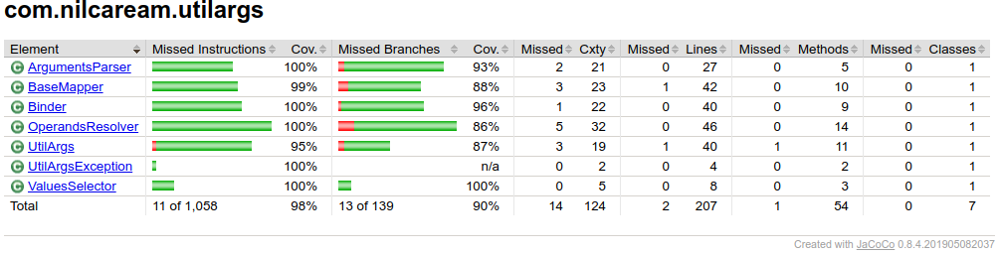

# Util Args
Java utility argument parser originally based on a [POSIX specification](https://pubs.opengroup.org/onlinepubs/9699919799/basedefs/V1_chap12.html). It is a pure-Java lightweight library without any external dependencies.

## Usages
```java
public class Example {
    @Option(value = "i", alternative = "input")
    private String inputFileName;

    @Option(value = "o", alternative = "output")
    private String outputFileName;

    public static void main(String[] args) {
        Example example = new Example();
        UtilArgs.bind(args, example);
        System.out.println("Input " + example.inputFileName);
        System.out.println("Output " + example.outputFileName);
    }
}
```
```shell script
user@hostname:~/examples$ java -jar example.jar -i input.txt -o output.txt

Input input.txt
Output output.txt
```  

## Maven
https://search.maven.org/artifact/com.nilcaream.utilargs/util-args/2.1/jar
```xml
<dependency>
  <groupId>com.nilcaream.utilargs</groupId>
  <artifactId>util-args</artifactId>
  <version>2.1</version>
</dependency>
```

## Coverage


## Thanks
This project has been developed with [IntelliJ IDEA Ultimate](https://www.jetbrains.com/?from=nil+caream) via JetBrains Open Source Free Licence Program.